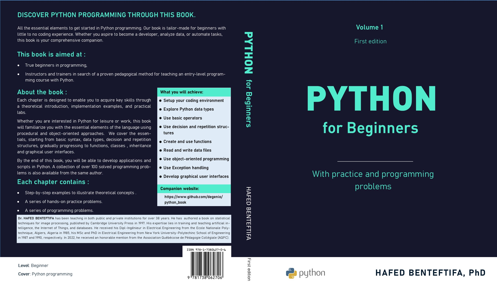

# Solutions for the programming problems in the book: Python for beginners

## Description

This repository contains the source code and programming examples for the book "Python through Practice." The book is intended for programming beginners who wish to learn Python or for those who want to enhance their existing skills.

The book covers the fundamental concepts of programming in Python, starting with basics such as variables, data types, loops, and conditions. It then delves into more advanced topics like functions, classes, and exceptions.

The main goal of this book is to provide readers with a strong foundation in Python and enable them to develop practical skills by solving real-world problems. Each chapter is accompanied by clear and concise code examples, as well as practice exercises and programming challenges to solidify the acquired knowledge.

## Book Contents

1 Introduction
2 Basic Syntax
3 Decision Structures
4 Repetition Structures
5 Functions
6 Sequences and Collections
7 Classes and Objects
8 Inheritance
9 Files
10 Exception Handling
11 Graphical Interfaces  
 

## Prerequisite

No prior programming knowledge is required to make use of this book. Detailed installation instructions for the PyCharm environment are provided in the first chapter of the book.

## Author

"Python for beginners" was written by Hafed Benteftifa. You can contact me at info@degenio.com for any questions or comments.

